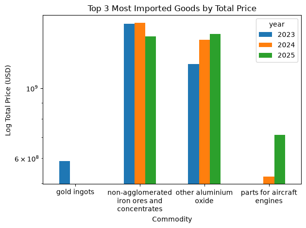
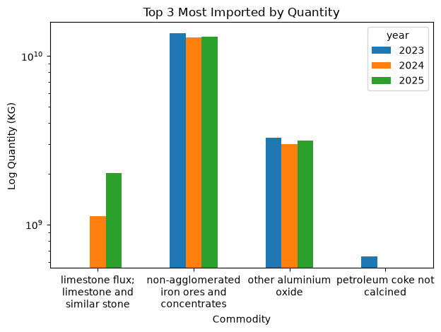
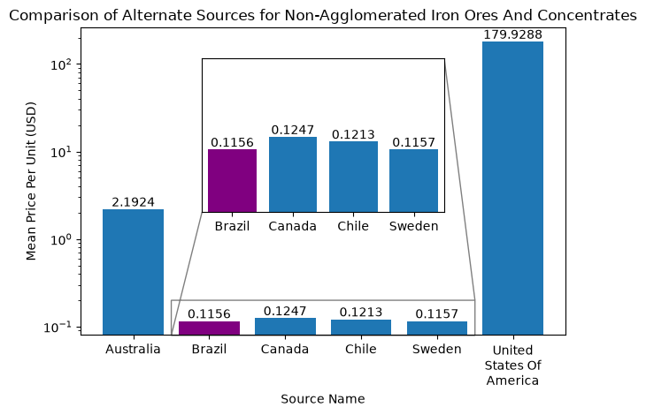

# Analysis of Imports Data

In this, the imports data for the years 2023, 2024 and 2025 were analyzed to find any potentials for improvement.

## The Amount of Money Spent on the Importing of Goods is Too Large.
In order to address this issue, 3 things needed to be done.

- 1) Find the Top 3 Most Imported Goods per year by quantity and price
- 2) After selecting one good, search for alternative sources within the data which have a more favorable price
- 3) Find potential savings when switching to this alternative source

### Objective 1:

The Top 3 Most imported goods per year by price and quantity were found 

Iron ores featured highly in both plots and so they were selected to continue with. 

### Objective 2:

Alternative sources of iron ores were found in the dataset, and their mean prices for the three years were calculated.

 
The lowest price found is shown in purple.

### Objective 3:

To find what the potential savings could have been, the spending on iron ores for the year 2025 were used. It was found that using the alternative source to purchase the same quantity, a potential costs reduction of $\approx \$5.7\times10^{6}$ could be made.

Acknowledgements:

- The data did not include shipment costs, so the true prices could end up being much larger.
- The viability of sourcing all goods from one location was not assessed.
- As the minimum cost found was a mean of historical data, there is no guarantee that future years have comparable prices.

